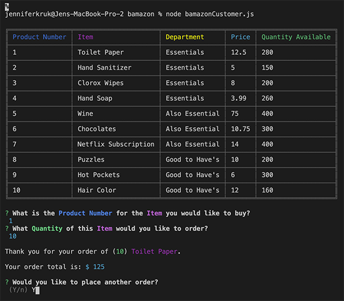
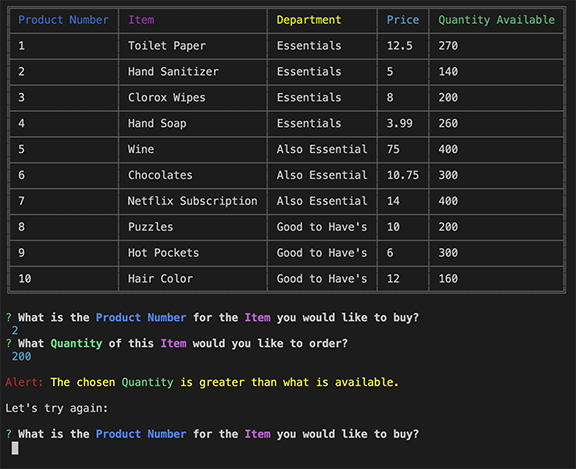
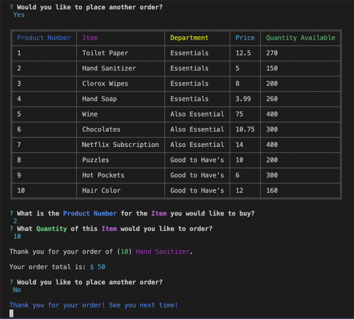

# bamazon

### A CLI store using Javascript, Constructors, Node.js, Inquirer and Chalk

## Instructions
* Place your order from the given menu of products

## Example of wanting to place another order

## Example of trying to order a quantity larger than available

## Example of completing your order

## Link to Demonstration Video:

https://drive.google.com/file/d/1jmO8-aApRug8hAIBm-BmKt2qcu7f1Ip4/view